# ICE4009 practice/project

> Inha Univ. Digital Communication System Capstone Design Practice/Project

## Index

| Week | Topic                                                                  |
| ---- | ---------------------------------------------------------------------- |
| 2    | [Uniform & Gaussian Distribution](./week02)                            |
| 3    | [Matlab Basic](./week03)                                               |
| 5    | [Sampling](./week05)                                                   |
| 6    | [Sampling, Quantization, Encoding, Decoding, and Reconstruction](./week06) |
| 7    | [BPSK](./week07)                                                       |
| 9    | [QPSK](./week09)                                                       |
| 10   | [BPSK in Rayleigh Channel](./week10)                                   |
| 12   | [BPSK in Rayleigh Channel for Image](./week12)                         |
| 13   | [OFDM](./week14)                                                       |
| 14   | [OFDM Wifi](./week14)                                                  |
| 15   | [Final Project](./week15)                                              |

## Practice

### Uniform & Gaussian Distribution

| Uniform Distribution                    | Gaussian Distribution              |
| --------------------------------------- | ---------------------------------- |
| 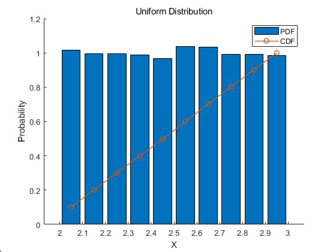 | 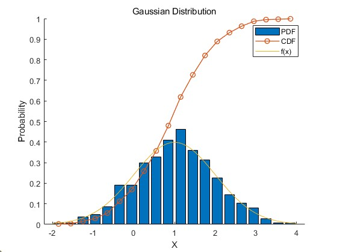 |

### Sampling, Quantization, Encoding, Decoding, and Reconstruction

| SQEDR                        |
| ---------------------------- |
| 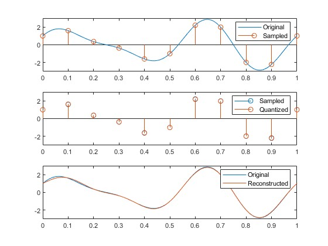 |

### BPSK

| Constellation                       | BER                           |
| ----------------------------------- | ----------------------------- |
| 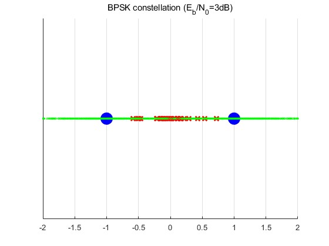 | 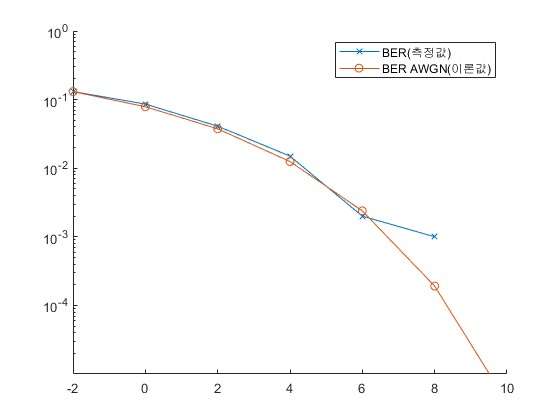 |

### QPSK

| Constellation                            | BER                                     |
| ---------------------------------------- | --------------------------------------- |
| 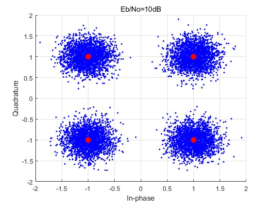 | 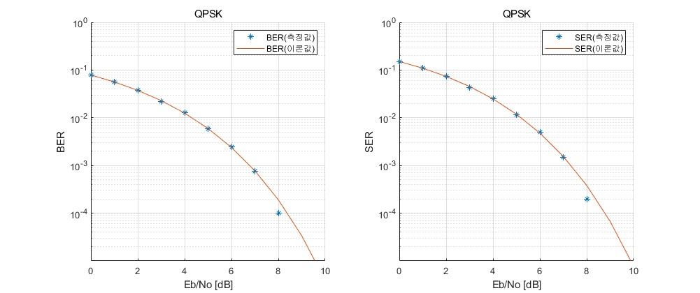 |

### BPSK in Rayleigh Channel

| PDF                               | Constellation                                               | BER                                    |
| --------------------------------- | ----------------------------------------------------------- | -------------------------------------- |
| 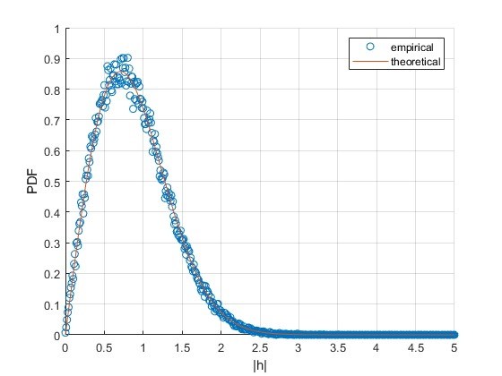 | 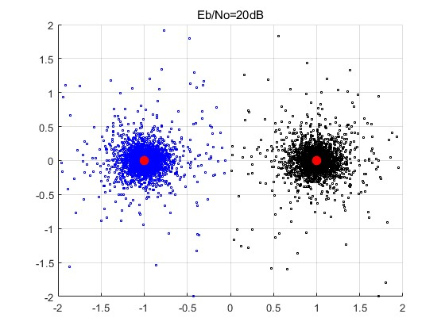 | 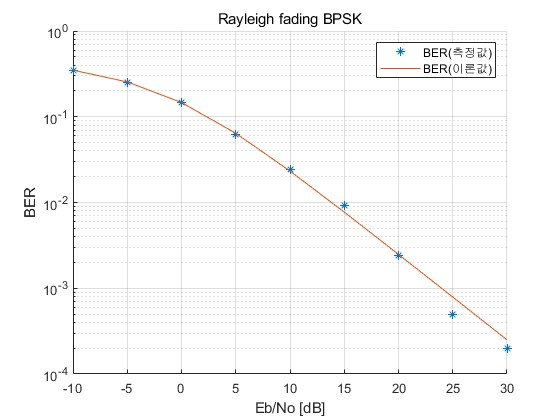 |

### BPSK in Rayleigh Channel for Image

| Image 1                               | Image 2                              |
| ------------------------------------- | ------------------------------------ |
| 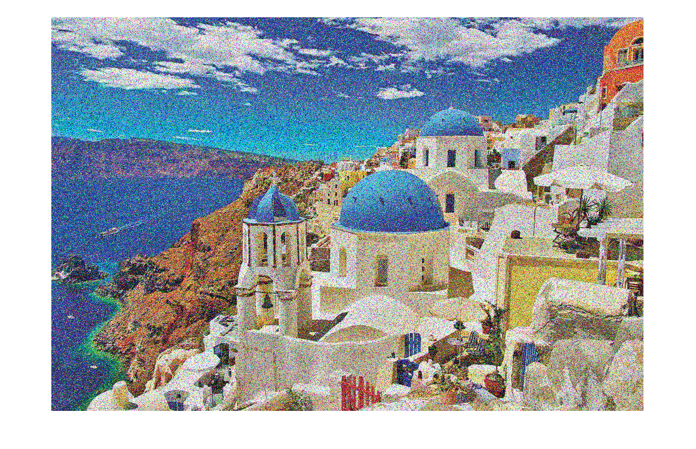 | 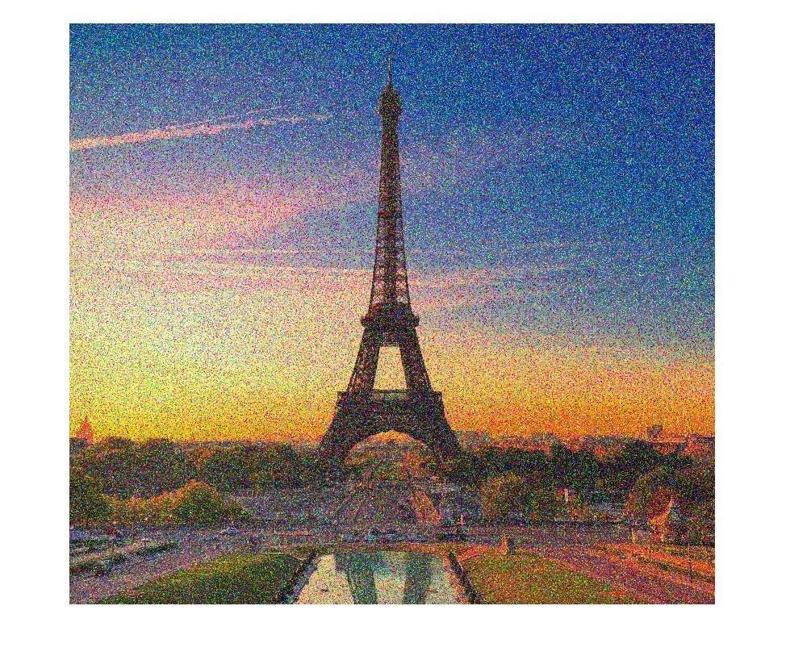 |

### OFDM

| Tx & Rx                           | BER                            |
| --------------------------------- | ------------------------------ |
| 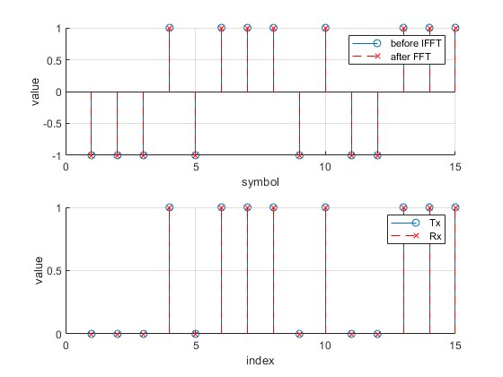 | 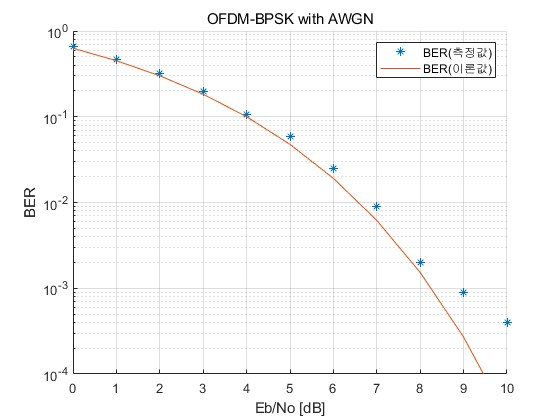 |

### OFDM Wifi

| Tx & Rx                                | BER                                |
| -------------------------------------- | ---------------------------------- |
| 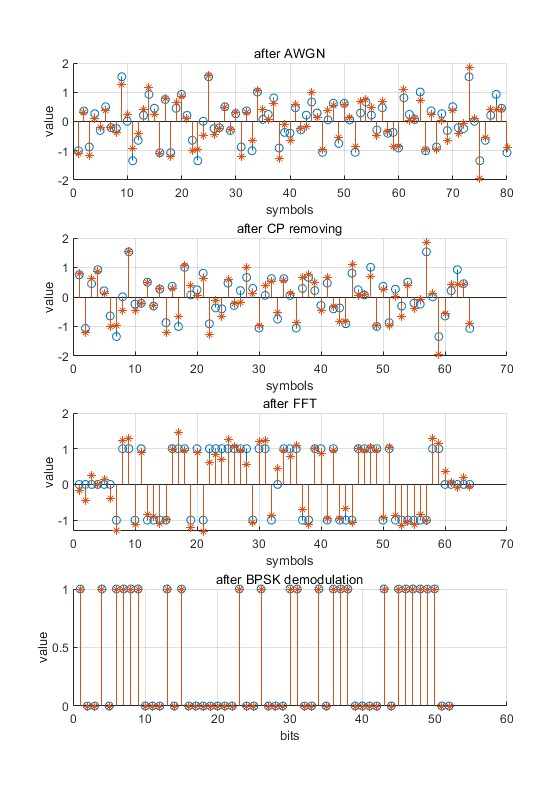 | 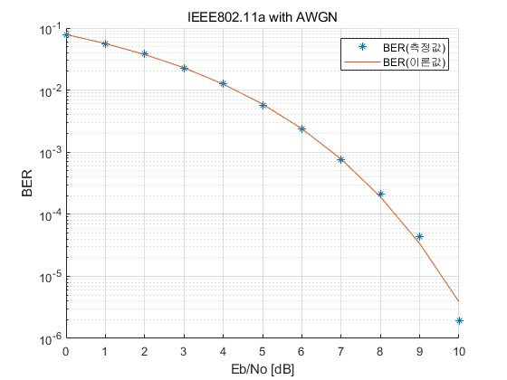 |

## Final Project

### Problem 1

| Answer                           |
| -------------------------------- |
| 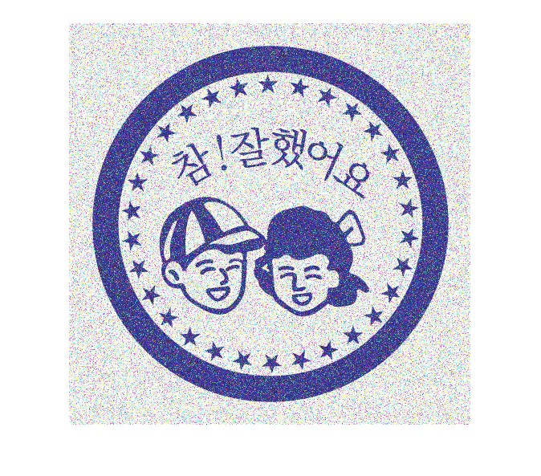 |

### Problem 2

Answer: [이브, 프시케 그리고 푸른 수염의 아내](https://youtu.be/eS-NAO3zmn4)
